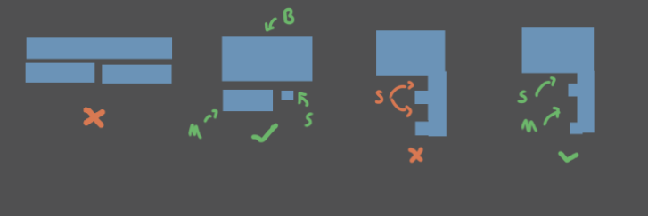
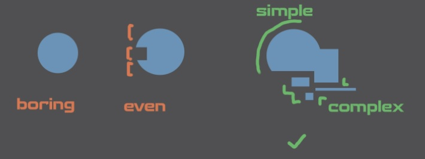
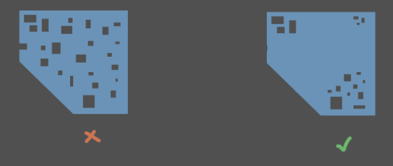
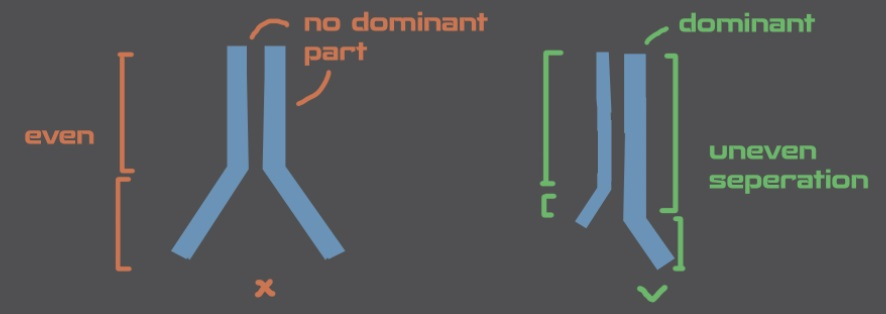
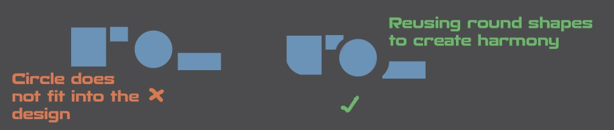
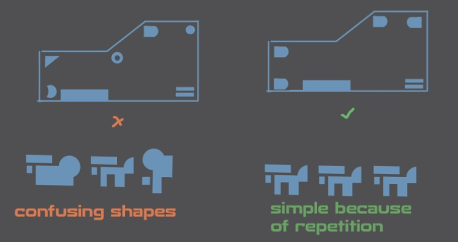
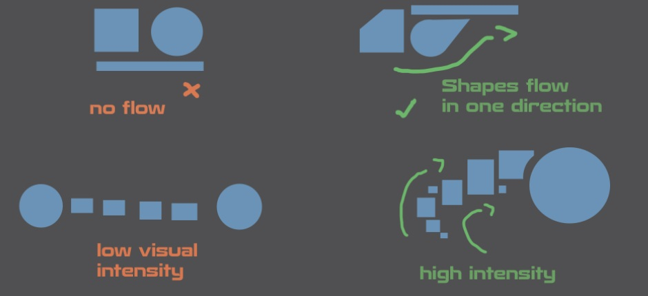
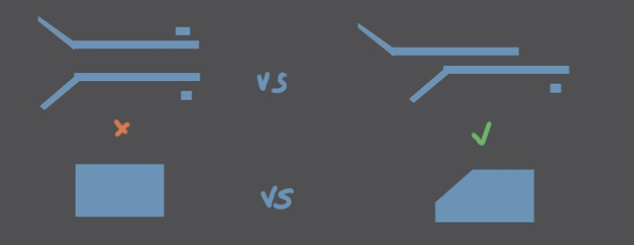
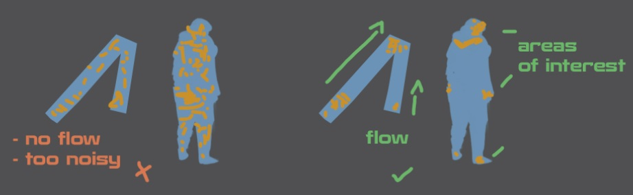
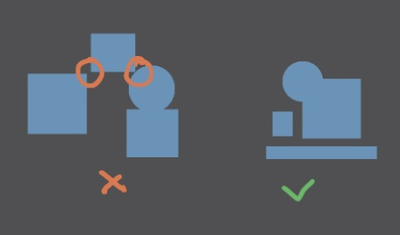

A collection of principles and idears to improve on visual design. These are not solid rules but rather observations on what could make a great visual design

## BMS & 70/30
- Avoid similar sizes
- Use 70/30 or BMS (Big Medium Small)
- Also look at negative shapes

> I think this is the most important lesson here: **Avoid seperation into even parts**
{: .prompt-tip }

## Shiluette
- Again avoid even seperation
- Beak shiluette to make it interesting
- Create areas of high and low complexity

## Rest Area
- Area of rest and area of complexity
- Use BMS and 70/30 with your detail distribution
- Avoid even detail distribution

## Hirachy of shapes
- By making some shapes dominant it is easier to read a design

## Harmony
- Reuse elements like shapes / Angles /Bevels etc
- Repeting design elements creates harmony

## Repetition
- Use Repetition to group together
    - If complex elements get repeated they get more simple as a result
- Use repetition to hold design together

## Flow
- Use the direction of shapes to create flow
    - A direction in design is often more pleasing
    - Guide the viewer and highlight parts of design
    - Shapes should not compete but work in harmony together to create a design

## Asymetry
- Asymetry in shapes is often a good thing
- Try to implement asymetric shapes
(But symetry can of course also be used intentional)

## Focal Point
- Use Detail placement to create focal point and guide the viewer
- Details and rest areas can create a flow in the design
        

## Interlocking Shapes
- Interlocking shapes hold together better
- makes it look manufactured / builded
        

## Tangents
- When two shapes touch each other or get too close
- Should be avoided (Overlap or seperate for better readability)

