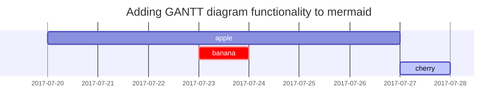

# Header 1 `code` [link](./) and [`code` link](./)
## Header 2 `code` [link](./) and [`code` link](./)
### Header 3 `code` [link](./) and [`code` link](./)
#### Header 4 `code` [link](./) and [`code` link](./)
##### Header 5 `code` [link](./) and [`code` link](./)
###### Header 6 `code` [link](./) and [`code` link](./)

Paragraph with `code` and [link](./) and [`code` link](./)

| Plain | Code   | Link       | Ymark                            | Nmark                           | Arrows       |
|-------|--------|------------|----------------------------------|---------------------------------|--------------|
| text  | `text` | [text](./) |  |  | 🡐 🡒 🡑 🡓 « » |

## Lists

### Ordered list

1. Firstly
2. Secondly
3. Thirdly

### Unordered list

- Chapter
  + Section
    * Paragraph

### ToDo list

- [ ] Job
  + [x] Step 1
  + [x] Step 2
  + [ ] Step 3

### Description list

Sun
: the star around which the earth orbits

Moon
: the natural satellite of the earth, visible by reflected light from the sun
: new line

## Block Quote

> This line shows the _block quote_.

## Prompts

> An example showing the `tip` type prompt.
{: .prompt-tip }
> An example showing the `info` type prompt.
{: .prompt-info }
> An example showing the `warning` type prompt.
{: .prompt-warning }
> An example showing the `danger` type prompt.
{: .prompt-danger }

## Links

<http://127.0.0.1:4000>

## Footnote

Click the hook will locate the footnote[^footnote], and here is another footnote[^fn-nth-2].

## Images

{: width="972" height="589" }
_Full screen width and center alignment_

<br>

{: width="50%" .w-75 .normal}
_50% left alignment_

- Float to left

  {: width="50%" .w-50 .left}
  Praesent maximus aliquam sapien. Sed vel neque in dolor pulvinar auctor. Maecenas pharetra, sem sit amet interdum posuere, tellus lacus eleifend magna, ac lobortis felis ipsum id sapien. Proin ornare rutrum metus, ac convallis diam volutpat sit amet. Phasellus volutpat, elit sit amet tincidunt mollis, felis mi scelerisque mauris, ut facilisis leo magna accumsan sapien. In rutrum vehicula nisl eget tempor. Nullam maximus ullamcorper libero non maximus. Integer ultricies velit id convallis varius. Praesent eu nisl eu urna finibus ultrices id nec ex. Mauris ac mattis quam. Fusce aliquam est nec sapien bibendum, vitae malesuada ligula condimentum. Phasellus a tortor aliquam, tristique felis sit amet, elementum enim. Integer vestibulum vitae nulla nec pretium.

- Float to right


  {: width="50%" .w-50 .right}
  Praesent maximus aliquam sapien. Sed vel neque in dolor pulvinar auctor. Maecenas pharetra, sem sit amet interdum posuere, tellus lacus eleifend magna, ac lobortis felis ipsum id sapien. Proin ornare rutrum metus, ac convallis diam volutpat sit amet. Phasellus volutpat, elit sit amet tincidunt mollis, felis mi scelerisque mauris, ut facilisis leo magna accumsan sapien. In rutrum vehicula nisl eget tempor. Nullam maximus ullamcorper libero non maximus. Integer ultricies velit id convallis varius. Praesent eu nisl eu urna finibus ultrices id nec ex. Mauris ac mattis quam. Fusce aliquam est nec sapien bibendum, vitae malesuada ligula condimentum. Phasellus a tortor aliquam, tristique felis sit amet, elementum enim. Integer vestibulum vitae nulla nec pretium.


## Inline code

This is an example of `Inline Code`.

## Code block

### Specific filename

{: file='foo.cpp'}
```c++
UCLASS(DisplayName="Unreal Name")
class UFoo : public UObject
{
    // Test if Github's C++ processor has UE preprocessor support
    UPROPERTY(BlueprintReadWrite, Category="Xist")
    bool bHopeForSuccess = true;
    Foo(const FObjectInitializer& ObjectInitializer = FObjectInitializer::Get())
      : Super(ObjectInitializer)
      {}
};
```
## Youtube




## Mermaid SVG



## Mathematics

The mathematics powered by [**MathJax**](https://www.mathjax.org/):

$$ \sum_{n=1}^\infty 1/n^2 = \frac{\pi^2}{6} $$

When $a \ne 0$, there are two solutions to $ax^2 + bx + c = 0$ and they are

$$ x = {-b \pm \sqrt{b^2-4ac} \over 2a} $$


## Reverse Footnote

[^footnote]: The footnote source
[^fn-nth-2]: The 2nd footnote source